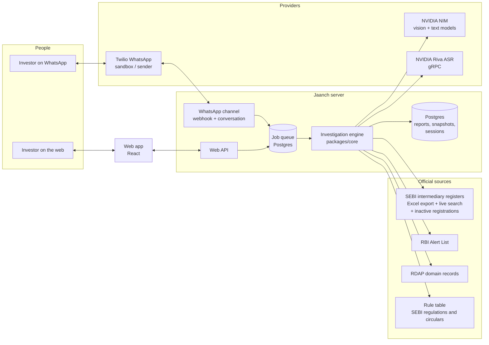
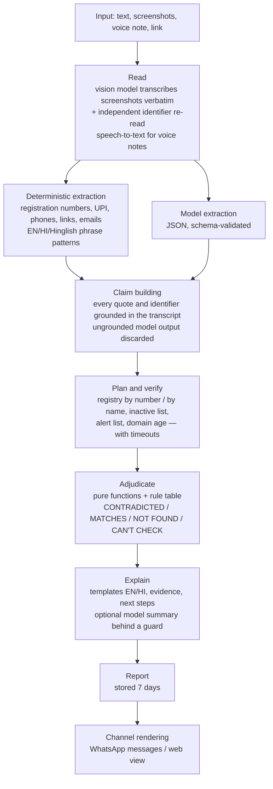
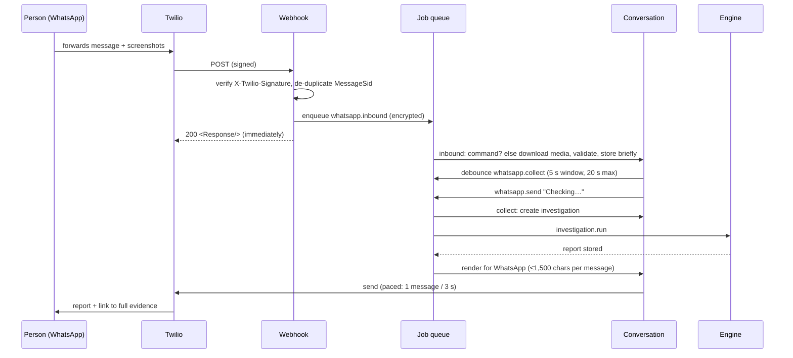

# Architecture

Jaanch is one investigation engine with two channels in front of it. The engine reads a message,
lists its claims, checks them against official sources and decides each claim with fixed rules.
Language models only read and (optionally) summarise; they never decide.

## System context

## Packages

| Package            | What it does                                                                                                                                                                                                                                                                                                                      |
| ------------------ | --------------------------------------------------------------------------------------------------------------------------------------------------------------------------------------------------------------------------------------------------------------------------------------------------------------------------------- |
| `packages/core`    | Domain schemas (zod), deterministic extraction (registration numbers, UPI IDs, phones, links, emails, EN/HI/Hinglish phrase patterns), claim building and grounding, verification planning, adjudication, the rule table, explanation templates (English + Hindi), report/web/WhatsApp/summary rendering, and the engine. No I/O. |
| `packages/db`      | One `Db` interface over node-postgres (production) and PGlite (embedded Postgres for development/tests); SQL migrations; repositories; the job queue.                                                                                                                                                                             |
| `packages/sources` | Official source adapters and their ingestion: SEBI registers (Excel export, live search, inactive list), RBI Alert List, RDAP. Fictional fixtures for development, clearly labelled.                                                                                                                                              |
| `packages/llm`     | NVIDIA NIM client (202 polling, JSON-mode negotiation, retries), screenshot reader with tiling and consensus re-read, claim extractor, narrator, Riva speech-to-text, live model probe.                                                                                                                                           |
| `apps/server`      | Composition root: configuration, Fastify HTTP server, web API, Twilio WhatsApp channel, event-driven worker, ingestion and operations CLI.                                                                                                                                                                                        |
| `apps/web`         | The web app: compose → progress → report → "I already paid". Renders server-built view models; contains no investigation logic.                                                                                                                                                                                                   |

## The pipeline

Which steps involve a model:

| Step                        | Model?                           | Guarantees                                                                                                                        |
| --------------------------- | -------------------------------- | --------------------------------------------------------------------------------------------------------------------------------- |
| Reading screenshots / audio | Yes                              | Verbatim instructions; unclear fragments listed; second identifier read compared; audio identifiers always "uncertain"            |
| Extraction                  | Yes, plus deterministic patterns | JSON schema validation; quotes and identifiers must occur in the transcript; identifiers taken from deterministic extraction only |
| Verification                | No                               | Official sources only; every access records as-of date, retrieval time, mode (snapshot/live), staleness, fixture flag             |
| Adjudication                | No                               | Pure, deterministic; uncertain readings and loose name bindings cannot produce CONTRADICTED                                       |
| Explanation                 | Optional                         | Templates for every factual sentence; a model summary is shown only if it adds no numbers, identifiers, labels or advice          |

## Claim types and how each is decided

| Claim                                                                                       | Checked against                                                                                                    | Possible verdicts                                                                             |
| ------------------------------------------------------------------------------------------- | ------------------------------------------------------------------------------------------------------------------ | --------------------------------------------------------------------------------------------- |
| SEBI registration (number and/or name)                                                      | SEBI registers (snapshot → live search → inactive list), name comparison over legal/trade/proprietor/contact names | MATCHES, CONTRADICTED (belongs to someone else / cancelled / expired), NOT FOUND, CAN'T CHECK |
| Identity ("this is from X")                                                                 | Registers by name; contact channels vs the record (phone, email domain, website, look-alike domains)               | MATCHES, NOT FOUND, CAN'T CHECK                                                               |
| Guaranteed returns                                                                          | Rule table (registered advisers/analysts/brokers may not promise assured returns)                                  | CONTRADICTED when paired with a SEBI-registration claim, otherwise CAN'T CHECK + warning      |
| Regulator/exchange endorsement                                                              | Rule table (SEBI does not approve securities; exchanges/SEBI do not endorse)                                       | CONTRADICTED, CAN'T CHECK                                                                     |
| Payment destination (UPI/bank/QR/crypto)                                                    | Rule table (validated `@valid` UPI IDs for intermediaries), handle structure                                       | CONTRADICTED, CAN'T CHECK (+ SEBI Check guidance)                                             |
| App install                                                                                 | Link analysis (APK, app store, sideload) + SEBI cautions                                                           | CAN'T CHECK + warning                                                                         |
| Special access (institutional/FPI account, pre-IPO, IPO allotment, block deals, VIP groups) | Rule table (FPI route unavailable to residents) + SEBI/exchange cautions                                           | CONTRADICTED (FPI), CAN'T CHECK + warning                                                     |

Behavioural patterns (urgency, secrecy, moving to private groups, OTP/remote-access requests,
pay-to-withdraw, profit screenshots, accuracy claims, crypto payment, personal UPI IDs) become
warnings with severity, never verdicts. RBI Alert List hits, new domains, look-alike domains,
shorteners and raw-IP links are warnings with evidence.

## Channels

The engine knows nothing about channels. Each channel is an adapter:

- **Web** (`apps/server/src/channels/web`): `POST /api/v1/investigations` (multipart or JSON)
  returns an id and a one-time owner token; the client polls `GET /api/v1/investigations/:id`
  for progress and the report view; summary, recovery and delete endpoints complete the flow.
- **WhatsApp** (`apps/server/src/channels/whatsapp`): a `MessagingTransport` interface with a
  Twilio implementation, and provider-independent conversation logic.

Commands are recognised only when the whole message is a command word — `HELP`, `HINDI`,
`ENGLISH`, `PAID`, `DELETE`, `REPORT` (and Hindi equivalents) — so a forwarded pitch is never
mistaken for a command.

## Data model and retention

| Table                                   | Holds                                                                                                                            | Retention                                           |
| --------------------------------------- | -------------------------------------------------------------------------------------------------------------------------------- | --------------------------------------------------- |
| `investigations`                        | Status, stage, report JSON (claims, evidence, verdicts, transcript), owner-token hash, requester HMAC                            | 7 days (`REPORT_TTL_DAYS`), or earlier on DELETE    |
| `jobs`                                  | Queue; payloads encrypted with AES-256-GCM where they contain message content or reply addresses; payload scrubbed on completion | Completed jobs deleted after 7 days                 |
| `blobs`                                 | Uploaded media until read                                                                                                        | Deleted right after reading; hard expiry 30 minutes |
| `channel_sessions`                      | WhatsApp language preference, last report id, pending (encrypted) parts — keyed by HMAC of the user id                           | 30 days of inactivity                               |
| `inbound_messages`                      | Provider message ids (idempotency)                                                                                               | 14 days                                             |
| `registry_entities`, `source_snapshots` | Official register snapshots and their provenance                                                                                 | Replaced on each ingestion                          |
| `alert_list_entries`                    | RBI Alert List snapshot                                                                                                          | Replaced on each ingestion                          |
| `cache_entries`                         | Live lookup cache (SEBI 6 h, RDAP 7 days)                                                                                        | Expiry                                              |

A sweeper deletes expired rows every 6 hours (and via `cli sweep`).

## Freshness and provenance

Every report lists each source consulted with status (ok / unavailable), mode (snapshot / live /
static rule table), the source's own as-of date, retrieval time and a fixture flag. Every
evidence item links to the public page where a person can see the same record. SEBI snapshots
older than 72 hours (`SNAPSHOT_STALE_HOURS`) and RBI Alert List snapshots older than 14 days (the
list changes rarely) are marked stale in the report.

## Failure behaviour

| Failure                               | Behaviour                                                                                                                                |
| ------------------------------------- | ---------------------------------------------------------------------------------------------------------------------------------------- |
| Language model unavailable or retired | Text is still checked with deterministic patterns; screenshots are reported as unreadable; the report says the AI reader was unavailable |
| SEBI live search down                 | Answers from the snapshot, labelled as such; with no snapshot, CAN'T CHECK                                                               |
| RBI list / RDAP unavailable           | Listed under "Could not check"; nothing inferred                                                                                         |
| Unclear screenshot                    | Identifiers marked uncertain; never CONTRADICTED; "check the number in the original message"                                             |
| Webhook missed during a cold start    | Boot-time catch-up lists recent inbound messages from Twilio and processes any not yet seen                                              |
| Worker crash mid-job                  | Lease expires; job re-queued; investigations are idempotent                                                                              |
| WhatsApp send fails mid-sequence      | Only unsent messages are retried (no duplicates); permanent provider errors (user left sandbox, 24-hour window) are dropped and logged   |

## Deployment shape

One Docker image runs everything (API, webhook, worker, web app, CLI). On free tiers: Render web
service + Neon Postgres, with the web app optionally on Vercel. See [deployment.md](deployment.md)
and [technical-decisions.md](technical-decisions.md).
