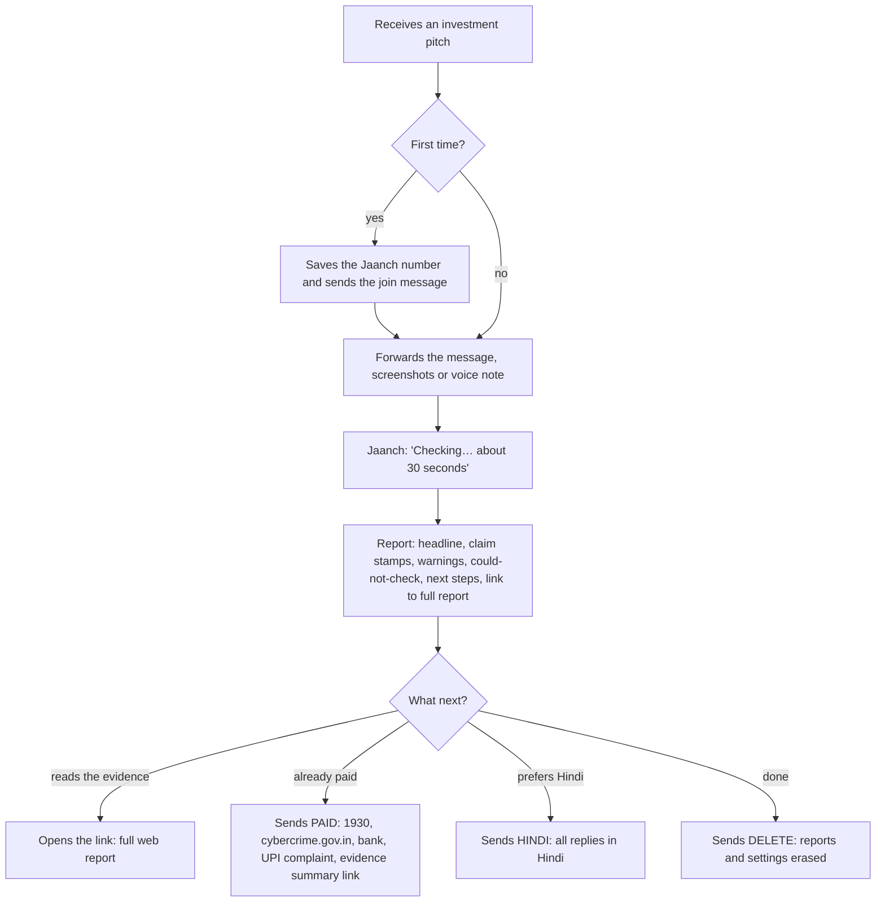
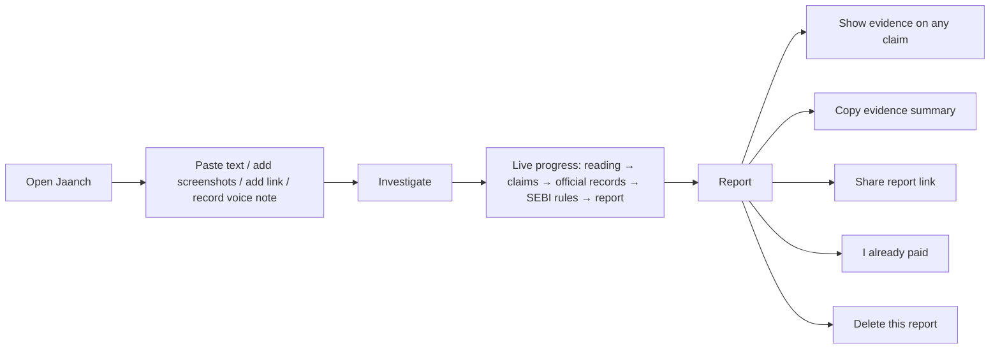

# User workflows

## 1. WhatsApp: forward a message



**Joining (sandbox only).** Save the sandbox number shown on the web page and send the join
phrase (for example `join letter-now`). Twilio confirms. The sandbox session lasts 3 days; after
that, send the join phrase again. A production WhatsApp number would not need this step.

**Sending content.** Forward the text, send up to 5 screenshots, or a voice note. Items sent
within a few seconds of each other are investigated together. Jaanch acknowledges immediately.

**The reply.** One or two WhatsApp messages (each under 1,500 characters). Below is the engine's
output for the demo pitch against SEBI's live register on 4 Oct 2026, with the claim extraction
supplied in the shape the model returns (the contact email from SEBI's record is shortened):

```
*Jaanch report* 🔎
The registration number is real. It just isn't theirs.

*What the message claims*
❌ *CONTRADICTED* — Sharma Investments is registered with SEBI (Research Analyst) under number INH000011431.
   The message says INH000011431 belongs to Sharma Investments. SEBI's register shows INH000011431 is registered to 360 ONE Distribution Services Limited (Mumbai) — a different name.
🔍 *NOT FOUND* — This message is from Sharma Investments.
   We found no SEBI-registered intermediary named Sharma Investments (register updated 3 Oct 2026).
❌ *CONTRADICTED* — Returns are guaranteed: 30% per month.
   The message claims SEBI registration (Research Analyst) and also promises guaranteed returns. SEBI's rules do not allow registered advisers, analysts or brokers to promise assured returns.
❌ *CONTRADICTED* — Payment should go to UPI ID 9876501234@ybl.
   The message asks for payment to 9876501234@ybl for a SEBI-registered service (Research Analyst). SEBI requires registered intermediaries to collect UPI payments through validated UPI IDs ending in “@valid…”, and their old UPI IDs were to be discontinued. 9876501234@ybl is not such an ID.
❔ *CAN'T CHECK* — You can get a 'VIP' group membership.
   The message offers a 'VIP' group membership. SEBI and the stock exchanges have warned that offers like this on social media are used to defraud investors.
```

```
*Warning signs*
⚠️ The message promises guaranteed or risk-free returns (“Guaranteed 30% monthly returns in F&O”). SEBI says assured, guaranteed or fixed-return schemes are prohibited by law.
⚠️ The message advertises an accuracy or success rate (“Our last 50 calls gave 100% accuracy”). SEBI's rules do not allow registered advisers and analysts to advertise accuracy percentages or unverified past performance.
⚠️ 9876501234@ybl looks like a personal UPI ID (made from a mobile number), not a business collection account.

*Could not check*
• Who runs the WhatsApp/Telegram groups or channels — we can't check that.
• Whether any promised return will actually be paid — no one can check the future.

*What to do next*
1. Pause before paying. The checks in this report found problems with what this message claims.
2. To confirm, contact 360 ONE Distribution Services Limited using the details on SEBI's record (…@iiflw.com) — not the numbers in this message.
3. Check any UPI ID, QR code or bank account on SEBI Check before paying a SEBI-registered firm. https://siportal.sebi.gov.in/intermediary/sebi-check

Full report: https://<your-domain>/r/J…

Reply PAID if you already sent money · HINDI for Hindi · HELP for help
```

**Commands** (the whole message must be the command, so forwarded text is never misread):

| Send                                     | Effect                                                                  |
| ---------------------------------------- | ----------------------------------------------------------------------- |
| `HELP`, `hi`, `namaste`, `मदद`           | How to use Jaanch                                                       |
| `HINDI` / `हिंदी`, `ENGLISH`             | Switch reply language                                                   |
| `PAID`, `I already paid`, `पैसे भेज दिए` | Recovery steps for the last report, with a link to the evidence summary |
| `REPORT`                                 | Link to the last report                                                 |
| `DELETE`, `मिटाओ`                        | Delete reports and settings                                             |

## 2. Web: paste or upload



**Report layout:**

1. Headline (a summary of the claim verdicts, never an overall rating) and dates.
2. Tally of verdicts.
3. _In short_ — only when a model-written summary passed the safety guard.
4. _What the message claims_ — one entry per claim: stamp, the claim in plain words, the exact
   quote from the message, the explanation, caveats, and _Show evidence_ (official record fields,
   rule citations, links, as-of dates).
5. _Who is contacting you, and who is registered_ — the channel-binding table.
6. _Warning signs_ — by severity.
7. _Could not check_ — always present when something wasn't checkable.
8. _What to do next_ — numbered, with official links and tap-to-call numbers.
9. _What we read from your message_ and _Sources checked for this report_ (collapsed).

The language switch (top right) re-renders the same report in Hindi or English.

**Samples.** The home page offers three clearly labelled sample messages (a fake adviser, a crypto
doubling pitch, a genuine SIP reminder) so anyone can see how Jaanch behaves; samples are checked
against the same live sources.

## 3. "I already paid"

Reachable from every report (button) and on WhatsApp (`PAID`). It is routing, not a complaint
portal, and collects nothing:

1. Call **1930** (national helpline for reporting financial fraud) — tap to call.
2. File at **cybercrime.gov.in**; report the numbers, UPI IDs and links used.
3. Tell your **bank** through the number on your card or passbook or the official app.
4. Raise a **fraudulent transaction** complaint in your UPI app or on NPCI's UPI Help.
5. **Keep evidence**: screenshots, transaction ID (UTR), numbers, UPI IDs, links.
6. _(Only if the message really came from a registered firm)_ complain to the firm, then on
   **SEBI SCORES**.
7. Beware of anyone offering to recover the money for a fee.
8. **Copy the evidence summary** (report id, timestamps, each claim with the official record,
   identifiers from the message, sources and as-of dates) and attach it to the complaint.

## 4. A legitimate message

A genuine message is not flagged for using financial words. A mutual-fund SIP reminder with the
standard "subject to market risks" disclaimer produces no claims and no warnings. A message from a
registered firm that uses its registered name, its number and its official email domain produces
**MATCHES** for the registration and **MATCHES** for the contact details — with the caveat that
details can be copied, and the could-not-check list still shown.

## 5. When something is unclear

- Blurry number in a screenshot → **CAN'T CHECK**, "check the number in the original message";
  if one plausible reading exists in the register, it is offered as a possibility.
- Model or source unavailable → the report says which, and nothing is inferred from silence.
- Voice note when speech-to-text isn't configured → "voice notes can't be checked yet".
